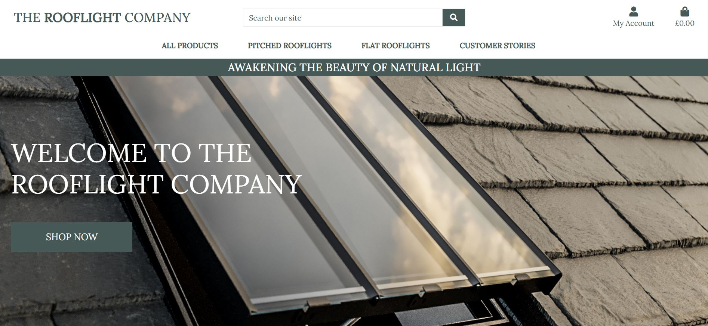

# The Conservation Rooflight Range (The Rooflight Company)

This project The Conservation Rooflight Range, is a webiste selling premium rooflights for both heritage and modern buildings, There will be a login and sign up function along with the user being able to upload their own story, plus be able to edit or delete also.

## Showcase

A deployed version of my website can be found [here.] ()

## navigation

* [UX](#ux)
  + [UX-stories](#ux-stories)
* [Strategy](#strategy)
  + [User-needs](#user-needs)
  + [Business-vision](#business-vision)
  + [seo](#seo)
* [Scope](#scope)
* [Structure](#structure)
* [Wireframes](#wireframes)
  + [Changes](#changes-to-wireframes)
* [Features](#features)
* [Technologies](#technologies)
* [Testing](#testing)
  + [Testing-plan](#testing-plan)
  + [Implementation](#implementation)
  + [Results](#results)
* [Bugs](#bugs)
* [Deployment](#deployment)
* [Credits](#credits)
* [Content](#content)
* [Media](#media)
* [Acknowledgements](#acknowledgements)

## UX

User stories can be found [here](media/User_journey.JPG) 

## First time visitor goals

* As a first time visitor, my aim is to feel engaged and drawn in by the big imagery.
* As a first time visitor, my aim is to be able to find what I am looking for very easily with an simple navigation through the site.
* As a First Time Visitor, I want to easily understand the main purpose of the site and learn more about the organisation.
* As a First Time Visitor, I want to be able to easily navigate throughout the site to clearly see all products on offer.
* As a First Time Visitor, I want to be able to easily navigate throughout the site and filter down the products to suit my own needs.
* As a first Time Visitor, I want to have all the infomation I need to make a decision to whether I purchase a product or not.
* As a first Time Visitor, I want to have the ability to create my own account.
* As a first Time Visitor, I want to have the ability to read other users stories.

## Returning visitor goals:

* As a returning visitor, my aim is for the site to be familiar and clear for the visitor to find what they were previously researching.
* As a returning visitor, I want a returning visitor be reasured if they've forgottten their pasword to their account they can eaily reset it.
* As a Returning Visitor, I want visitors to upload their own story and be able to edit or delete also.
* As a Returning Visitor, I want visitors to feel reasurred they are buying in a safe environment.
* As a returning visitor, I want to check if there has been any more Stories uploaded to read.

The end goal of the project is to sell a high end premium product.

### UX stories

Buyer Journey can be found [here](media/Buyer_journey_map.JPG)

* As a user I want to find a high end product for my property.
* As a user I want to log in to my own account.
* As a user I want to upload, edit or delete my own personal story.
* As a user I want to find out more about the company I may buy from.
* As a user I want to be confident my purchase is done in a safe environment.
* As a user I would like to filter through the products knowing I am buying the correct item for my needs.

## Strategy

### User Needs

As a user the site has to be accessible on mobile, tablet and all browsers. Information should be clear to read, informative and helpful.
The site navigation needs to be optimal to move to the preferred section of the user.

### Business vision

The purpose of this project is to give users ability to create their own account, upload their own stories as well as search throguh products for sale, filter them down my heritage or modern types or building alomg with if they need a flat or pitcxhed rooflight. 
The site also gives the users the option to register for an account, with further login / log out functionality. 
The ability to read, like and leave a comment on recent Customer Stories.

### SEO

SEO means Search Engine Optimization and is the process used to optimize a website's technical configuration, content relevance and link popularity so its pages can become easily findable, more relevant and popular towards user search queries, and as a consequence, search engines rank them better. 

* my key words can be found [here](media/keywords.JPG)
* Content is king research can be found [here](media/contentisKing.JPG)
* Marketing types research can be found [here](media/Marketingtypes.JPG)

## Scope

I want my users to feel reassured they are buying a high end product for their property. 

## Structure

This project is a 1 main home page website. With button to take to the shop now page which shows all products, from there you can filter through trh ranges from pitched and flat roofs to Heritage and modern style homes. A menu to Customers stories, wher you can read throguh prior custoners purchased and experiences within the company and see the fnished rooflights installed. A register for an account page with a subsiquence login / log out function is also on the nav bar along with the funsction for the user to upload thier own story..

## Wireframes

The original wireframes for home page can be found [here](media/wireframe.JPG)

The Tablet wireframe for home page can be found [here](media/tablet_wireframe.JPG)

The Mobile wireframe for home page can be found [here](media/mobile_wireframe.JPG)

### Changes to wireframes

My site has changed considerably from the intitial wireframe, as I had my initial idea and as I started to build my page it took me in another direction, the more I descovered new methods and styles.

## Features

This section contains some of the features this project contains:
* The homepage will be the landing page showing a large hero image to draw people in, an introduction to what the site is and a shope now button.
* Scrolling down to a short paragraph, then an image carosel
* Scrolling further a short paragraph regarding building regs and a link to a government website about Building regulations and laws.
* Scrolling down to an about the company section.
* Followed by a footer with social media links adn an option to sign up to Mailchimp. 
* There ais an addition shop page where the user has the option to browse through all ranges or filter down to meet their specific needs
* A Register for an account page where the user will submit their personal details to open an account.
* Once registered, the user can then have the option to log in in future, or log out.

## Technologies

This project was build using the following technologies:

### Languages
* HTML5
* CSS3
* Javascript
* Python
* Django

### Libraries and online resources:
* Google Chrome Dev Tools: for testing purposes.
* My chosen fonts [Google Fonts}](https://fonts.google.com/).
* W3C HTML-validator: Used to find mistakes in my html code. [HTML-validator](https://validator.w3.org/nu/#textarea)
* FontAwesome: used for icons in the logo. [FontAwesome](https://fontawesome.com/)
* Coolors: to chose a color scheme. [Coolors](https://coolors.co/palettes/trending)
* Responsinator to check my website on all devices. [Responsinator](https://www.responsinator.com/).
* README template from code institute fellow student [README.md template](https://github.com/ThijsTerporten/Climbing-Traveller/blob/master/README.md).
* Adobe Photoshop for editing my Photos
* All Medai in this project are taken from my current employment The Rooflight Company for educational purposes only, this website will not be used as part aof my role within the company.
* Adobe InDesign for my Wireframe
* Bootstrap Library
* Heroku
* AWS for static file storage
* Mailchimp 
* Facebook [here](media/facebook.JPG) my page has since been diables by Facebook.

### Testing

## Testing Plan

Starting this project I know what my target audience would like to see on a website with buying a high end product as its topic. I took into consideration on what devices my users would like to see the website on. For testing I designed the website mobile first, with extensive testing using Chrome DevTools for all Iphone's. Using DevTools I continued testing the website using settings for the Ipad and a 15.6 inch laptop screen. For large screens I used a 24 inch monitor. I wanted my page to be seen in a horizontal manner on larger screens a vertical manner for small screens, and on medium sized screens I am aiming to be in the middle of these two.

### Testing User Stories from User Experience (UX) Section

## First Time Visitor Goals

As a First Time Visitor, I want to easily understand the main purpose of the site and learn more about the organisation.

* Upon entering the site, users are automatically greeted with a clean and easily readable navigation bar to go to the page of their choice. Underneath there is a Hero Image with Text and a "Shop now" Call to action button.
* The main points are made immediately with the navigation bar and call to action button.
* The user has the option to stay on the home page and read a bit about the company, click on the shop now button to take them to all products, create an account or filter throguh the products for their specific needs.
* As a First Time Visitor, I want to be able to easily be able to navigate throughout the site to find content.

* The site has been designed to be fluid and informative, easy to navigate. Each link describes what section the visitor will end up on.
* As a First Time Visitor, I want them to locate our social media links to see our following on social media to determine how trusted and known we are.
* As a First time visitor, I want them to sign up to our mailing list in the footer and recieve our monthly newsletr rearding the company and any new products.

* Once the new visitor has read through the site..
* The user can also scroll to the bottom of any page on the site to locate the social media links in the footer.

## Returning Visitor Goals

* As a Returning Visitor, I want the visitor to find the where they were previously and feel confident to make the step to purchase.

* As a Returning Visitor, I want them to sign up to our newsletter via Mailchimp if they didn't as a new user.

* The home page clearly highlights the "Shop Now".

* Here they can fill out the form on the page or alternatively they can message the organisation on social media.
* The footer contains links to the organisations Facebook, Twitter and Instagram page.
* Whichever link they click, it will be open up in a new tab to ensure the user can easily get back to the website.
* As a Returning Visitor, I want them to find the Facebook Group link so that they can join and interact with others in the community.

* The Facebook Page can be found at the footer of every page and will open a new tab for the user and more information can be found on the Facebook page.

## Frequent User Goals

As a Frequent User, I want to check to see if there are any newly added help, advice or new products.

* The user would already be comfortable with the website layout and can easily click the call to action buttons or the navigation bar.
* As a Frequent User, I want them to check to see if there are any new infomation, stories to read or comments.
* The user would already be comfortable with the website layout and can easily click the links to external sites.
* As a Frequent User, I want them to follow us on social media.

### Further Testing

* The Website was tested on Google Chrome, Internet Explorer, Microsoft Edge and Safari browsers.
* The website was viewed on a variety of devices such as Desktop, Laptop, iPhone7, iPhone 8 & iPhone X.
* A large amount of testing was done to ensure that all sections were linking correctly.
* Friends and family members were asked to review the site and documentation to point out any bugs and/or user experience issues.
* PEP8 code check for Python

### Implementation

Testing was mainly done using DevTools in google chrome. 
Starting mobile first then working my way up to bigger screen sizes. 
Whenever an element wasn't located where I wanted it to be I would use the `element.style` box in DevTools to find a solution. 

I used the WC3 code validators to check my code for mistakes as well. 

Testing is done in the following way: 

1. Scroll up and down the page checking for overflow and general positioning of items.
2. Use navigation bar to move to section of the page. 
3. In the form, try and click the button to check whether all fields are required to be filled in, check as well whether the e-mail part was set to e-mail.
4. Check all links in the footer whether they react as intended by opening in a new tab (for links section in footer). 
5. Run through all of these steps for each different screen size.
6. Use HTML and CSS validators from W3C schools to find mistakes in code.
7. Use PEP8 to validate my python code.
8. Use JShint to validate my JavaScript.
9. Use TestCase to test my Django
10. Jest to test my Javascript functions.

### Results

Once I had a general idea on how to run testing I followed all steps for each of my pages which gave me the following results:

* CSS-validator All Pags results: [media/CSSResults.JPG]

* PEP8 results: [media/PEP8Results.JPG]

* HTML Homepage results: [media/HTMLHomepageResults.JPG]
  * I will investigate further to why these errors have shown.

* HTML Product Page results: [media/HTMLProductPageResults.JPG]
  * I will investigate further to why these errors have shown.

* HTML Customer Story results: [media/HTMLCustomerStoriesResults.JPG]
  * I will investigate further to why these errors have shown.

* TestCase Django - I tried to follow the wakthrough to test my Django project, However I have ran out of time to conclude this process. I will investigate this further at a later date.

* Jest - I tried to follow the wakthrough to test my Django project, However I have ran out of time to conclude this process. I will investigate this further at a later date.

### Bugs need fixing
* Favicon icon isn't showing on all pages although in the head of my base.html
* Testing has been implemented but errors need further investigating. (I ran out of time I've had Covid - Sorry)
* Css for mailchimp isn't pulling through to heroku deployed version but is showing on my local server, css for this is in teh head of teh base.html.

#### Django 

I wasn't very confident in my Django project, therfore having to delete it all and starting again, after lots of tutor help and my fellow coders on slack I managed to successfully install my project for a story and log in log out funtion along with the function for teh logged in usedr to upload their own story and comment on others. Also following the, 'Boutique_ado', walkthrough helped massively.

## Deployment

This project is deployed using Heroku.
I used gitpod to write all code and seeing it is linked with github it was easy to use the terminal to commit.

## The project was deployed to Heroku

1. Log in to Heroku and create a new app
2. On the resources tab provision a new prostgres database.
3. Back in gitpod and install dj_database_url and psycopg2-binary.
4. Freeze the requirements.
5. Still in Gitpod, got to settings.py import dj_database_url, comment out the default configuration and replace the default database with a call to dj_database_url.parse, give it the database URL from Heroku by going to settings tab in Heroku and reveal Config Vars.
6. Show Migrations, check all is ok then migrate.
7. load data catergories first then load products.
8. Create superuser for Django
9. Delete the call to dj_database_url.parse, and comment back in the default configuration.
10. Create an 'if' statement in Settings.py so when the app is running on Heroku where the database URL environment variable will be defined.
11. Install Gunicorn then freeze this into requirements.
12. Create the Procfile to tell Heroku to create a web dyno. Which will run Gunicorn and serve our django app.
13. Temporarily disable collectstatic. use Heroku config set, disable collectstatic equals 1 using --app as I have more than one app.
14. Add allowed host name in settings.py plus local host.
15. Add and commit the changes in gitpod, git push heroku master to deploy to Heroku
16. Set to automatically deploy when pushed to github by going to Heroku app - deploy method set to Github, search for the repository, click connect. Finally enable automative deploy
17. Create a Secret key and add it to config variables in Heroku
18. Setting.py replace the Secret key setting with a call to get it from the environment and use an empty string.
19. Set DEBUG to be true only if there's a variable called development in the environment.
20. Commit and push to Github
21. Go to Heroku check the build is in progress and all is ok.

## Forking the GitHub Repository

By forking the GitHub Repository we make a copy of the original repository on our GitHub account to view and/or make changes without affecting the original repository by using the following steps...

1. Log in to GitHub and locate the GitHub Repository
2. At the top of the Repository (not top of page) just above the "Settings" Button on the menu, locate the "Fork" Button.
3. You should now have a copy of the original repository in your GitHub account.

## Making a Local Clone

1. Log in to GitHub and locate the GitHub Repository
2. Under the repository name, click "Clone or download".
3. To clone the repository using HTTPS, under "Clone with HTTPS", copy the link.
4. Open Git Bash
5. Change the current working directory to the location where you want the cloned directory to be made.
6. Type git clone, and then paste the URL you copied in Step 3.

$ git clone https://github.com/YOUR-USERNAME/YOUR-REPOSITORY

7. Press Enter. Your local clone will be created.

$ git clone https://github.com/YOUR-USERNAME/YOUR-REPOSITORY
> Cloning into `CI-Clone`...
> remote: Counting objects: 10, done.
> remote: Compressing objects: 100% (8/8), done.
> remove: Total 10 (delta 1), reused 10 (delta 1)
> Unpacking objects: 100% (10/10), done.

## Credits 

* Fontawesome for use from their icons. [Fontawesome](https://fontawesome.com/).
* Responsinator to check my website on all devices. [Responsinator](https://www.responsinator.com/).
* README template from code institute fellow student [README.md template](https://github.com/ThijsTerporten/Climbing-Traveller/blob/master/README.md).
* Bootstrap for templates and components [https://getbootstrap.com/docs/5.1/getting-started/introduction/].

## Content

All content in this project are taken from my current employment The Rooflight Company for educational purposes only, this website will not be used as part aof my role within the company..

## Media 

* All Medai in this project are taken from my current employment The Rooflight Company for educational purposes only, this website will not be used as part aof my role within the company..
 

## Acknowledgements 

I would like to acknowledge the tutor support available. They reassured me when I was doubtful of myself and my skills, and pointed me in the direction of some useful information during our tutoring sessions about things they saw I was struggling with. Especially during the Django project and creating models and views for the stories section.

**This project was created for educational purposes only**

**Created by Mel Watts**